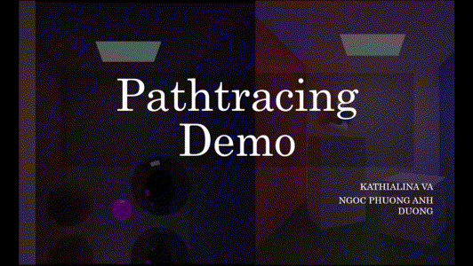
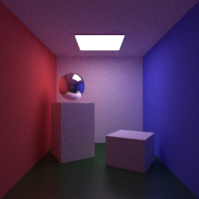

# Path Tracer
[EPITA ISIM (Image Synthesis)](http://jo.fabrizio.free.fr/teaching/synt/index.php) Project by Anh DUONG, Kathialina VA

Most of implemented algorithms are based on [Mathematical Models and Monte Carlo Algorithms for Physically Based Rendering](https://graphics.cs.kuleuven.be/publications/ERICLPHD/index.html).



Algorithm/features implementations:
- Stratified/jittered sampling
- Classic Pathtracer: only indirect illumination
- Pathtracer with direct illumination
- Bidirectional Pathtracer: on going, currently does not work well with several BSDFs
- BSDFs: Diffuse, Mirror, Phong, Blinn-Phong, Opacity, refraction

```
USAGE:
make all
main <available_scene> --debug [--classic|--bdpt] [-fn filename] [-ns N_sample] [--indirect N_indirect_bounces] [--direct N_direct_bounces]

available_scene: simple, cornell_box, pyramids, multi_light

Options:
--debug     display debug msg
--classic   run classic pathtracer algorithm. Default is pathtracer with direct illumination
--bdpt      run bidirectional pathtracer algorithm. Default is pathtracer with direct illumination
-ns         number of sample rays per pixels, should be a square number

```
Example output of 
```./main cornell_box -ns 216```



### References
All of the algorithms used in this project are based on references below:
 - Mathematical Models and Monte Carlo Algorithms for Physically Based Rendering by Eric P. Lafortune: [here](https://graphics.cs.kuleuven.be/publications/ERICLPHD/index.html)
 - Realistic Image Synthesis (SS 2019) Assignment 5: [here](https://graphics.cg.uni-saarland.de/courses/ris-2019/assignments/assignment_nee_mis.pdf)
 - Computer graphics III – Multiple Importance Sampling: [here](https://cgg.mff.cuni.cz/~jaroslav/teaching/2015-npgr010/slides/06%20-%20npgr010-2015%20-%20MIS.pdf)
 - Chapter 10: Bidirectional path tracing: [here](https://graphics.stanford.edu/courses/cs348b-03/papers/veach-chapter10.pdf)
 - Bidirectional Path Tracing 8 - Combine multiple s,t strategies optimally: [here](hhttp://rendering-memo.blogspot.com/2016/03/bidirectional-path-tracing-8-combine.html)
 - Reflections and Refractions in Ray Tracing: [here](https://graphics.stanford.edu/courses/cs148-10-summer/docs/2006--degreve--reflection_refraction.pdf)
 - Global Illumination Compendium: [here](https://people.cs.kuleuven.be/~philip.dutre/GI/TotalCompendium.pdf)
 - Assignment 3: Monte Carlo Raytracing: [here](https://canvas.dartmouth.edu/courses/20530/assignments/101949)
 - The Blinn-Phong Normalization Zoo: [here](http://www.thetenthplanet.de/archives/255)
 
 